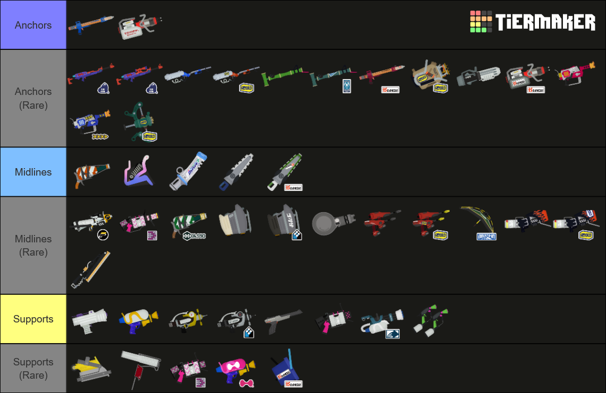

# 더블 중거리

- [조합 예시](./Sample.md)
- [운영](./Macro.md)
- [변주](./Variations.md)
- [상성](./Matchups.md)

## 자료

### 정석

- [연필-버킷-사무-샤프 미러](https://youtu.be/hwElcBDLrgg?t=8430)
- [익잼-보틀-롱블-샤프네오](https://youtu.be/oZd3XeNKkJI?t=2816)
- [버킷-롱블](https://youtu.be/OUT0Wt9MVNo?t=4214)
- [민트-버킷-스시](https://youtu.be/CXk-GZUHFjk?t=5827)

### 변주

- [몹링-버킷-52갤](https://youtu.be/S2DQcyNv-8E?t=11989)
- [듀얼 스위퍼](https://youtu.be/oZd3XeNKkJI?t=6525)
- [리터-흑잽](https://youtu.be/OUT0Wt9MVNo?t=5314)
- [96데코-롱카스](https://youtu.be/e1MISnzNvXU?t=5721) (4세트 : 익잼-에리데코, 5세트 : 볼펜-흑잽)
