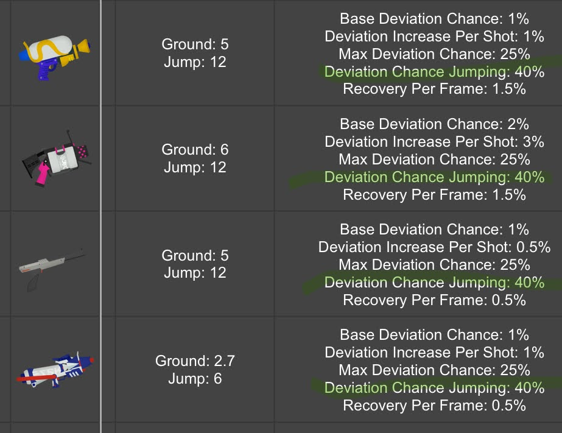

# 기어

## 필수

- 독점
  - 스텔스 점프
    - 슈퍼 점프를 뛰었을 때 잘릴 확률이 **크게** 감소
    - 여러 팀원이 채용 시 게임의 템포를 크게 가속
    - 상대가 슈점을 확인하지 못 해서, 내가 이득 볼 가능성이 생김
      - 상대는 슈점을 예상하는 데에 크게 압박 받음
    - 실질적으로 모든 무기가 채용할 수 있으나, **특히** 앞라인에 중요
      - 띠용과 궁합이 **매우** 좋음
- 공용
  - 슈퍼 점프 시간 단축
    - 한타에 제때 합류할 가능성이 **크게** 증가
    - 공격과 타개의 템포 가속
    - **더불어** 한타 중에 슈점을 통한 이동 가능
    - 몇 칸 넣기 **매우** 쉬움
      - 0.2, 0.1, 1.0 추천
    - **_모든_ 기어에 무조건 채용**

## 매우 좋음

- 독점
  - 컴백
    - 스페셜 증가량 업 효과로 타개를 클러치 가능
    - 교환이나 짧게 교전할 때 주도권을 가지기 좋음
      - 버프 시간(리스폰 후 20초)를 이어가기 쉬움
    - 대부분 앞라인이 채용하지만 거의 모든 무기가 써도 좋음
  - 라스트 스퍼트
    - 몇몇 무기들이 교전을 마무리하기 위해 **매우** 필요한 잉크 효율 제공
    - 에어리어 관리하기 좋음
    - 폭탄을 가진 경우 딜량을 높이면서 상대를 몰아내거나 시간 끌기 좋음
      - 깔짝딜 넣기도 좋음
    - 메인이 많은 잉크를 소모하거나, 폭탄이 있지만 싸움에 약한 경우, **절박하게 필요**
      - 하지만 대부분의 무기에서 채용해도 좋음
- 공용
  - 징어대시 속도 업
    - 위험에서 벗어나기 위한 기본적인 기어
    - 한타에서 이동 및 아군 커버하기 좋음
    - 에너지 스탠드도 오속을 **완전히** 주지는 않기 때문에 냉장고와도 좋음
    - 모든 무기에 유용하지만, 몇몇 무기들은 **기회 비용** 문제에 봉착(무기에 더 필요한 기어 대신 오속을 채용)
    - 0.2에서 2.2까지 다양하게 채용
      - 1.2 이상은 드뭄
- 유틸
  - 상대 잉크 영향 감소
    - 상대 잉크를 만지기만 했다고 붙잡혀 터지는 경우를 감소
    - 몇몇 점프와 이동을 가능하게 함
      - 싸움에서 살거나 더 공격적인 움직임이 가능
    - 0.1 또는 0.2가 흔함
    - 대부분 채용하지만, 다른 유틸 기어를 넣는 무기도 있음(예: 띠용0.2 + 폭방0.1)
  - 스페셜 감소량 다운
    - 타개 때 스페셜을 채우기 **매우 좋음**
    - 죽어도 리스크가 줄기 때문에 더 공격적인 2대1 교환 시도 가능
    - 일반적으로 0.1이지만 0.2도 괜찮음
    - 스페셜이 좋은 앞라인에 가장 좋지만 냉장고 뒷라인에도 **가끔** 좋음
  - 서브 영향 감소
    - 깔짝딜 또는 콤보딜 중심 무기를 상대하기 **매우** 편해짐
    - 버킷 상대로 한 번에 죽지 **않기** 때문에 더 공격적으로 상대 가능
      - 퀵밤 역시 폭방 상대로 **매우** 약해짐
    - 일반적으로 0.1이지만 0.2도 괜찮음
    - 거의 모든 무기에 좋지만 특히 앞라인과 지원에 좋음

## 좋음

- 독점
  - 스타트 대시
    - 스페셜 중심의 느린 조합을 상대하기 **매우** 좋음
    - 스페셜을 채우는 동안 팀이 싸울 동력이 필요할 때 해결책이 될 수 있음
    - 한타와 승패를 굴리기 **압도적으로** 좋음
      - **너무 신내지 않도록 주의**
    - 혼자서도 싸움에 강한 무기에 좋고, 상대의 위치를 파악할 수 있는 무기(센서, 미스트, 트랩)에서 지속하기 쉽고, 냉장고 무기(특히 이그재미너, H3, 어쪄면 스퍼터리)에서 괜찮음
  - 징어닌자
    - 몇몇 무기 상대로 터지지 않고 열린 공간을 지나갈 수 있음
    - 공격적인 각을 볼 때 **교환나지 않을 가능성** 증가
    - 근접해서 압박하는 상대에서 도망치기 좋음
    - 근접에서 1힛킬 또는 킬타임이 빠른 무기에 매우 좋음
    - 다만 위치를 파악할 수 있는 무기에 주의!
- 공용
  - 스페셜 증가량 업
    - 단순히 몇몇 무기를 가용하게 함
    - 강한 스페셜에 더욱 힘을 줌
      - 한타 설계를 가속
    - 메인이 약하지만 스페셜이 좋거나, 지원, 냉장고 무기에 좋음
      - 양 팀 모두 수동적으로 스페셜 중심으로 움직일 것으로 예상하면, 슾차업을 쌓는 것이 더욱 강력해짐
    - 기회 비용에 따라 0.2에서 2.1까지 채용
  - 부활 시간 단축
    - 냉장고 없이 죽을 때 **게임을 구할** 수 있음
    - 짧게 교전하거나 냉장고 없는 조합을 **존재**할 수 있게 함
      - 상대보다 빠르게 리스폰할 것을 알면 수많은 무기들이 교환을 노릴 수 있음
    - 띠용과 슾세와 궁합이 **너무** 좋음
      - 심지어는 냉장고와도 궁합이 좋음:
        - 냉장고로 교환 -> 빠른 리스폰 -> 다음 한타에서 좀비 발동
      - 앞라인에 좋고 교환을 많이 내는 지원에 괜찮음
  - 액션 강화
    - 몇몇 무기는 점프 탄퍼짐 감소로 교전 중 점프를 가능하게 함
      - 탄퍼짐 뿐만 아니라 정확도 자체가 감소하기 때문에 [점프 탄퍼짐은 매우 나쁨](https://docs.google.com/spreadsheets/d/1uUIEmHaZTRc-hXdnSlu_zJoeTrlLbF2OTBnc3Ix5nAw/edit?usp=sharing)
        
    - 넙치 언덕 단지 같은 맵에서는 징어클라임을 빠르게 쓰는 것이 괜찮을 수도
    - 전반적으로 장거리 슈터에 매우 좋음
  - 잉트 효율 업(메인)
    - 잉크 효율이 나쁜 무기가 메인을 **사용**할 수 있게끔 함
    - 잉크 효율이 나쁜 무기가 한 발 더 나갈 수 있게 함
    - 라슾으로 [특정 지점](https://sendou.ink/analyzer?weapon=2070&build=LDE,ISM,ISM,IRU,SCU,SPU,SPU,SCU,SJ,QSJ,QSJ,RES&build2=U,U,U,U,U,U,U,U,U,U,U,U&lde=21&effect=LDE&focused=1)을 닿을 수 있게 함
      - 최대로 발동한 라슾과 메효0.2를 채용하면, 연필은 정확히 4번 차지 가능
      - 라슾이 없을 경우, 메효 0.2로 3번 차지 가능
    - 무기마다 다르지만 일반적으로 1.3을 넘어 사용하지 않음
  - 서브 성능 업
    - 단거리 무기도 포킹 가능
    - 교전에서 마무리 또는 포킹딜 넣을 때 퀵밤이 **폭발적**
    - 특정 유틸 서브(트랩, 센서, 비컨)의 경우 효과가 괜찮고 효율이 높음
    - 0.2 이상 채용
  - 인간 이동 속도 업
    - 무빙을 따라가기기 **매우** 어려워져서 한타에서 살 수 있음
    - 상대를 따라가서 마무리하기 좋음
    - 교전 중 오속을 적게 사용하는 스피너 등에 좋음
    - 0.2에서 2.2 정도 추천
  - 잉크 효율 업(서브)
    - 단거리 무기가 폭탄으로 포킹할 수 있게끔 하는 것은 **매우 중요**
    - 압박과 팀이 공간을 밀어내기 훨씬 쉬워짐
    - 지원 무기의 지원 능력 증가
    - 몇몇 무기는 서브 1회 사용 후 메인 사용 횟수 추가
    - 0.1에서 2.2까지 채용
    - 라스트 스퍼트와 궁합이 좋음

## 가끔

- 독점
  - 리벤지
    - 일대일을 유리하게 만들기 좋음
      - 상대가 인간폼일 때 위치 확인
      - 리벤지 상대를 처치 시 리스폰 시간 증가 및 스페셜 감소량 증가
    - 효과를 보기 불안정하기 때문에 퀵리, 오속 등이 더 좋음
    - 앞라인 무기에 무난함
  - 오브젝트 공격력 업
    - 탱킹 스페셜을 깨기 쉬워짐
    - 하지만 스점을 희생하기 때문에 교전력에서 크게 손해를 봄
    - 스점이 필요하지 않으면서 오브젝트 깨기 좋은 뒷라인이나 폭탄을 가진 지원에서 쓸 수도 있음
  - 낙법
    - 슈점 자리를 숨길 수 없는 복귀 스페셜을 쓸 때 생존력 증가
    - 슈점 후 이동이 약간 빨라짐
    - 스점에 비해 리스크가 크고 슈점 마커를 숨지기 못함
    - 복귀 스페셜을 가진 경우 쓰기 좋음
  - 부활 페널티 업
    - 냉장고 없는 상대를 처치 시 **치명적**
    - 상대가 물기 더 까다로워짐
    - 내가 죽었을 때 리스폰 시간과 스페셜 감소량이 증가하고 냉장고로 무력화할 수 있기 때문에 밸류가 불안정함
    - 죽이기 어려운 **느린** 뒷라인에서 쓰기 좋음
- 공용
  - 잉크 회복력 업
    - 일반적으로 메효와 섭효가 잉크 관리하기 가성비가 더 좋음
    - 하지만, 가끔 0.1~0.2 채용하는 경우가 있음
      1. 메효 또는 섭효와 동시에 채용하여 유지력 증가
      2. 잉크 회복 불가 프레임이 거의 없는 경우. 새싹과 모델러는 15프레임으로 가장 짧으면서 1번 경우에도 해당하기 때문에 좋은 예시입니다. 또한 새싹은 잉크통이 더 크기 때문에 잉회0.2를 넣어 잉크 회복 속도를 다른 무기와 맞추면 좋습니다.
      3. 퀵밤 등 서브의 잉크 소모량이 50% 미만인 무기. 섭효와 함께 쓰면, 퀵밤의 경우 잉크 회복력이 더 빠릅니다. 라인마터도 회복 불가 프레임이 50프레임이기 때문에 아마 해당할 것이지만, 센서는 75프레임이라 확신은 없습니다.
    - 스페셜 성능 업
      - 스페셜에 따라 천차만별
        - 울샷 :
        - 배리어 :
        - 쇼크원더 :
        - 미사일 :
        - 먹구름 :
        - 나옥 :
        - 홉소나 :
        - 흡입기 :
        - 레이저 :
        - 제트팩 :
        - 망치 :
        - 게탱크 :
        - 샤크 :
        - 트리토네 :
        - 냉장고 :
        - 디코이 :
        - 크라켄 :
        - 울착 :
        - 스크린 :

## 못 씀

- 독점
  - 서멀 잉크
    - 직격을 맞춘 경우 14 초 간 상대의 위치를 확인할 수 있습니다. 간접에도 적용되었으면 더 유용했겠지만, 현재로써는 대부분의 무기들의 킬타임이 너무 빨라서 큰 효과가 없습니다. 쓰이는 경우는
      1. 탄속이 느리고 킬타임이 불안정한 무기. 욕조가 대표적입니다. 킬 내기 불안정하고, 위치 파악하는 것도 좋고, 기어 의존도도 낮습니다. 보틀, 젯스윕, 배럴, 히드라. 볼펜 등 장거리 스피너, 심지어는 듀스윕에서도 쓸 수 있다고는 들었지만 스피너와 듀스윕은 기어에 크게 의존하기 때문에 자리를 만들기 어렵습니다.
      2. 스크린. 스크린은 아군의 시야 또한 방해하기 때문에 1번 경우에 해당하면 더욱 유용할 수 있습니다. 포일보틀, 히드라커스텀, 포링배리어블에서 사용할 수 있겠습니다.
  - 역경 강화
    - 효과가 더 강하고 팀이 죽지 않아도 발동하는 슾차업에 크게 밀립니다. 스페셜이 강하고 계속 스페셜을 돌리려는 뒷라인이 슾차업과 계속 돌격하는 스타트대시 팀원과 쓸 수는 있겠습니다. 하지만 이는 솔랭 또는 특수한 조합의 경우에만 해당합니다.
  - 추가 기어 파워 2배
    - 총 기어 파워가 1점 감소하기 때문에 전혀 쓸모가 없습니다. 이론상 유용한 경우가 있다고는 들었지만 너무 특수한 경우라 의미가 없습니다.
