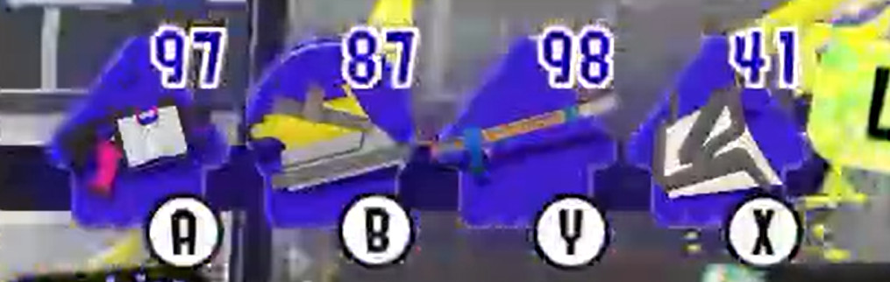
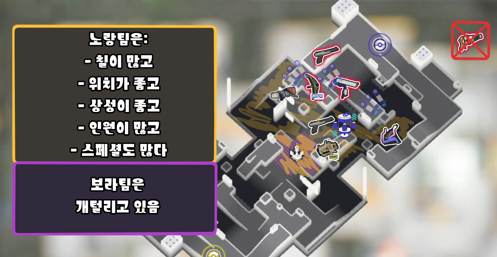
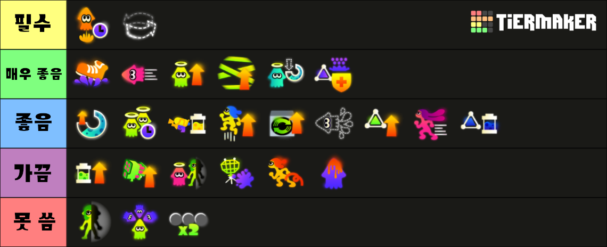

# 랭크 에어리어의 기초

## 조합 짜기

### 방법 1

**티어가 높은** 무기들을 중심으로 조합하기
[링크](https://x.com/PinkPuffyPastry/status/1842952877108756626) 참고

- 현재 좋은 무기는 많습니다. 지금은 인기 있는 무기, 또는 많은 시간을 쏟았지만 저평가된 무기를 사용하기 적기입니다.
- 우선 무기에 가장 어울리는 **스타일**을 사용하세요. 대부분의 앞라인은 보틀처럼 유리한 싸움을 걸거나, 쿼드처럼 돌격 후 팀원들이 도와줄 수 있도록 합니다. 몇몇은 둘 다 잘하기도 합니다.
- 그 다음에는 깔짝딜을 넣거나, 양각을 잡거나, 특정 매치업을 담당하는 등, 핵심 무기를 **공격적**으로 돕는 무기를 찾으세요. 쿼드와 드라이브 와이퍼, 롱블/보틀과 버킷, 카본과 52갤 등
- 두 무기를 찾았으니 부족한 부분을 채워야 합니다. 드왚과 쿼드는 킬을 내기 불안정할 수 있습니다. 그렇기 때문에 딜을 보충할 수 있는 라피에리데코 등을 넣으면 상대에 돌진할 기회를 늘릴 수 있습니다.
- 이 세 무기는 싸우는 동안 에어리어를 관리하고 뒤집을 무기가 **절실하게** 필요합니다. 이럴 때 새싹을 넣으면 완벽합니다! 이 다음에는 스크림에서 시험하고, 잘 풀리지 않으면 망설이지 말고 바꾸세요!

### 방법 2

프로 팀이 쓰는 조합을 수정하기
[링크](https://bsky.app/profile/pinkpuffypastry.bsky.social/post/3l5whrxj6iv26) 참고

- "어떤 팀이 이 조합으로 우승했지만, 몹링 플레이어가 없는데 어떻게 할까?"
  
- "깔짝딜이 좋아보이니까 롱블을 쓰자!" "아니, 락토데코를 쓰자! 인식은 나쁘지만 템포가 빠르고 샤크를 **엄청 많이** 쓸 수 있으니까 조합의 속도에 맞출 수 있어!" "그러지 말고 덴탈민트를 쓰자! 깔짝딜도 넣고, 에어리어 칠도 좋고, 스페셜도 잘 돌리니까!" 만족할 때까지 실험하세요.

### 팀 조합에서 무기 역할

- 대부분의 무기는 주어진 역할이 명확하지만, 모호한 경우도 있습니다.
- 조합을 짤 때는 이 점을 명심해야 합니다.
- 아래는 조합에서 여러 역할을 담당할 수 있는 무기들의 예시입니다.
  

## 솔로 캐리를 할 수 있는 템포와 능력

- 스플래툰의 템포는 _매우_ 빠르기 때문에 잘하기 위해서는 **속도전**이 매우 필수적입니다.
  - 강점이 **다양하면서 플랜B가 있는** 조합 짜기
    - 싸움에 강한 무기 여럿
    - 템포
    - 강력한 스페셜
    - 칠 좋은 무기
    - 이들은 조합을 짜면서 자연스럽게 모여야 합니다.
  - 팀원 **모두**가 조합의 목표를 이해하기
    - 이를 통해 팀원이 각자 빠르게 판단할 수 있습니다.
    - 이를 통해 게임 템포가 **매우** 빨라지고, 이는 일본 선수들의 특기입니다.
      - [피지컬, 위치 선정, 무기와 역할에 대한 이해를 마친 후에는, **지속적인 압박과 이동을 통한 매끄러운 게임 흐름**처럼 일본이 강한 것에 집중해야 합니다.](https://x.com/Xenithvee/status/1826387362655731912)
      - [(일본 선수들은) 기본기가 훨씬 탄탄하고, **항상 맵에 존재감이 있고,** 이타적으로 플레이합니다. 기본적로 정해진 위치 대신 **가장 영향력이 큰 곳**으로 가고, 지속적으로 적응하고, 딜을 하면서 최대한 커버해줍니다. 뒷치기를 갈 때도 잠복만 하는 것이 아니라 시선을 끌면서 맵에 영향력이 있습니다.](https://bsky.app/profile/greyspl.bsky.social/post/3l5w3p7kbpr2k)
    - 상대에 비해 우리 조합의 강점을 이해하면 게임 중 올바른 결정을 내리기 쉬워집니다.
      - 범위딜? 대면? 스페셜이 더 강하고 빠르게 도는가?
    - 좋은 피지컬로 에임을 맞출 것
    - 상대보다 **자원**이 더 많은 곳을 만들 것
      

## 기어와 플레이 스타일

올바를 기어를 채용하면 여러 크고 작은 것들이 쉬워집니다.

[기어](./Abilities.md) 참고

[원본](https://docs.google.com/document/d/1rXObdEACPItTrp2CMLoPr1WbHerHFiOWIjArmmMDdoE/edit?usp=sharing)
