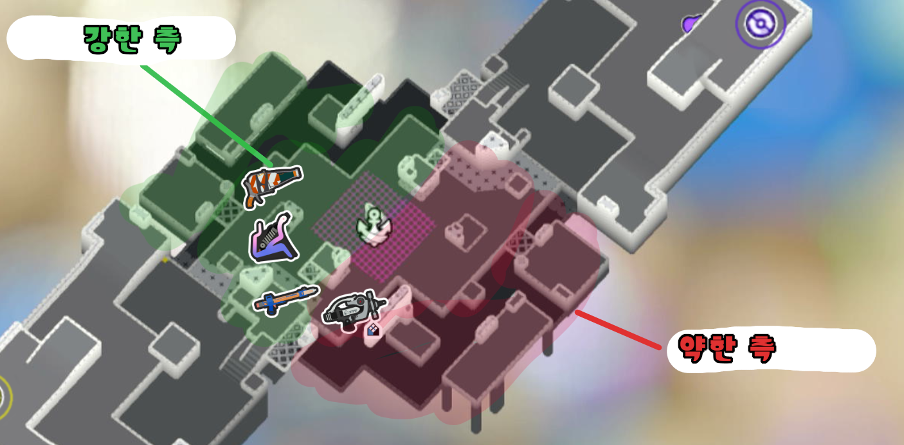

# 랭크 에어리어의 기초

플레이하면서 아래 사항들을 고려해야 합니다.

## <u>핫 존</u>과 <u>컬러 스팟</u>을 고려하여 대면하기

- 핫 존은 에어리어를 칠할 수 있는 에어리어 _주위의_ 공간을 일컫습니다.
  
- 이 구역 바깥에서 킬을 내기 위해 스페셜을 낭비하면 일반적으로:
  - 타개 시 상대를 밀어낼 **힘**이 부족해집니다.
  - 공격 시 타개를 막아낼 **자원**이 부족해집니다.
    - 상대를 압박하는 것은 여전히 중요합니다. 다만 핫 존 바깥에서 자원을 너무 많이 소모하지 않도록 주의해야 합니다.

- 핫 존 외에도 중앙에서 상대 집으로 향하는 여러 **컬러 스팟**이 있습니다.
  - 에어리어를 확보 후 압박 시, 상대의 구역을 노랑, 초록, 파랑, 빨강 순서로 공략해야 합니다.
    - 이와 동시에 뒷치기를 주의하면 상대를 강하게 압박할 수 있습니다.
  - 타개 시, 컬러 스팟을 되찾기 위해 다음을 할 수 있습니다:
    - 무리하는 상대 처치
    - 맵 장악력을 되찾는 교환 유도(2대1 교환 등)
    - 에어리어를 칠하거나 트리토네 같은 스페셜을 던지면서, 다시 말해 **오브젝트를 강제함**으로써 너무 공격적이거나 수동적인 상대를 맞받아칠 수 있습니다.

## 맵 장악이 킬보다 중요

- 킬은 결국 맵을 장악하기 위한 수단입니다!
- 굳이 싸움을 무릅쓰지 않고도 공간을 차지할 수 있다면 _좋은 상황입니다._
- **또한 차지한 공간을 <u>곧바로</u> 빼앗기지 않도록 무리하지 않아야 합니다.**
  
- 공간을 되찾기 위해서는 스테이지에서 **강한 측**과 **약한 측**을 이해해야 합니다.
  - 강한 측은 자원이 _더 많거나_ 강한 무기가 많은 측입니다.
  - 약한 측은 이들이 부족하여 밀기 더 쉬운 측입니다.
    
  - 강한 측에 있다면 더 많이 대면하고 늘어져도 좋은 싸움을 할 수 있습니다.
  - 약한 측에 있다면 "자원이 *부족*할 때" 문단을 참고하세요.

## 유리함을 굴리기 - 타이머

- 잘 짠 조합은 일반적으로 상대를 재촉하기 위한 여러 방법이 있습니다.

  - 스페셜 타이머 (상대가 행동하지 않는다면, 트리토네로 에어리어를 확보할 것이다)
  - 칠 타이머 (우리 칠이 더 많고 맵 전체를 장악할 것이다)
  - 대면 상성 타이머 (메인 무기의 힘으로 상대를 몰아낼 것이다)

  

- 상대적인 유불리함에 따라 한타를 풀어나가는 방향이 **달라집니다.**
- 누가 어떤 자원을 가지고 있는지 파악하는 *시야*가 중요합니다.
  - 이점은 **주요**와 **부가** 이점으로 나눌 수 있습니다.
    - 주요 이점
      - 인원 수
        - 리스폰과 슈점으로 인해 이 시간은 변동적입니다.
      - 칠
      - 스페셜
    - 부가 이점
      - 에어리어 칠
      - 위치 선정
        - 엄폐물, 고/저지대, 직선 시야, 올라탈 수 있는 벽
      - 노이즈
        - 나는 상대를 볼 수 있지만 상대는 없거나 다른 것에 주의가 끌린 경우
      - 프레임 정보
        - 롤러 같은 무기 또는 게탱크 같은 스페셜의 후딜 활용
        - 핑 딜레이 때문에 활용하기 어려울 수 있습니다.
      - 유틸성
        - 서브 무기
        - 내가 받은 버프 효과
        - 상대가 받은 디버프 효과
  - 이점이 _많은 경우_
    - 공격적으로 싸우기
      - 무리하면 안되지만 전선을 밀어야 합니다.
  - 이점이 _비슷한 경우_
    - 상대의 행동에 대응하기
      - 일대일을 걸면, 싸움에 강한 무기로 맞대응하기
      - 스페셜을 쓰면, 스페셜을 사용하여 반격
      - 에어리어를 칠하면, 덧칠하기
    - **무난한 수** 두기
      - 상대가 할 법한 행동들을 고려
      - _전부_ 대처할 수 있도록 선택
  - 이점이 _부족한 경우_
    - 다음과 같은 선택이 있습니다:
      - 히트 앤 런
        - 상대를 한 발만 맞추거나 처치 후 도망치기
      - 빠르게 움직이면서 상대를 기습하기 (상대의 약한 측을 노리면 이상적)
      - 상대의 강한 측에 올인하여 상대가 스페셜을 나에게만 소모하도록 유도
        - 팀원이 버티고 슈점을 제공할 수 있을 정도로 편성이 강하다면, 뒷치기 경로가 적은 일자형 맵에서 시도할 만합니다.
      - _천천히_ 스페셜 채우기
    - 팀에 가장 큰 **임팩트**를 줄 수 있도록 선택해야 합니다.
      - 깔끔한 킬 또는 2대1 교환
      - 냉장고 버프가 없는 상대 또는 상대의 지원/뒷라인을 킬
      - 한타에서 첫 킬 내기

## 랭크 에어리어의 인기가 _가장 많은_ 이유

- 다섯 가지 룰 중 가장 *기본적*이다
  - 영역 배틀은 다른 룰에 비해 마지막 순간이 _매우_ 중요하다
  - 랭크 타워는 상대를 완전히 밀어낼 수 있다
  - 랭크 피시 배틀은 상대를 밀어낼 수 있을 뿐만 아니라, 몇 초 사이에 수십 점을 얻을 수 있다
  - 랭크 바지락은 혼란스럽고 무작위적으로 느껴진 뿐만 아니라, 단번에 수십 점을 획득할 수 있다
- 한타를 배우기 좋다
- 석순 대협곡에서 랭크 피시 배틀을 할 때에 비하면 랭크 에어리어 맵은 _공평하게_ 느껴진다
  
